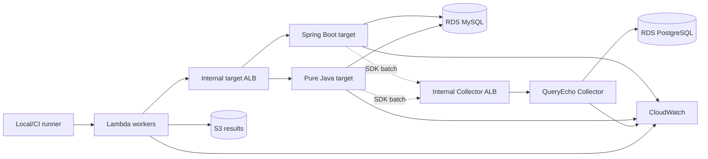

# 부하 테스트 아키텍처

## 요청과 수집 흐름

실선은 사용자 요청과 업무 SQL, 점선은 SDK 관측 이벤트다. Lambda는 DB를 직접 호출하지 않는다.

## 네트워크

- Public subnet 2개: Internet Gateway와 단일 NAT Gateway
- Private app subnet 2개: Lambda, ECS, 내부 ALB
- Private DB subnet 2개: RDS MySQL, PostgreSQL
- Target ALB는 Lambda 보안 그룹에서만 접근
- Collector ALB는 대상 앱과 Lambda 보안 그룹에서만 접근
- MySQL은 대상 앱 보안 그룹에서만 접근
- PostgreSQL은 Collector 보안 그룹에서만 접근

단일 NAT는 테스트 환경 비용을 줄이기 위한 선택이며 가용 영역 장애를 검증하는 구성이 아니다.

## 애플리케이션 계약

Spring과 순수 Java 대상 앱은 비교 가능한 부하를 위해 동일한 API를 제공해야 한다.

| API | 동작 | 예상 수집 |
|---|---|---|
| `GET /health` | 헬스 체크 | 업무 SQL 없음 |
| `GET /api/load/standalone` | Auto Commit 쿼리 1회 | 트랜잭션 ID 없는 쿼리 |
| `POST /api/load/transaction` | 고정 SQL 실행 후 COMMIT | 동일 ID의 쿼리와 COMMIT |
| `POST /api/load/rollback` | 고정 SQL 실행 후 ROLLBACK | 동일 ID의 쿼리와 ROLLBACK |

응답 크기, SQL 개수와 데이터 조건을 양쪽 앱에서 동일하게 유지한다.

## 단계별 실행

1. 앱별 요청 1건으로 DB 상태와 Collector 저장을 확인한다.
2. 워밍업을 수행한다.
3. SDK OFF 기준선을 측정한다.
4. SDK ON을 같은 설정으로 측정한다.
5. 동시 요청을 5, 10, 25, 50 순서로 높인다.
6. Spring 단독, Java 단독, 두 앱 동시를 분리한다.
7. 종료 후 SDK 큐가 비워질 시간을 두고 생성·전송·저장 건수를 대조한다.

## 현재 의도적으로 제외한 항목

- 운영 수준의 Multi-AZ와 자동 확장
- 공개 Dashboard
- Route 53와 TLS 인증서
- AWS WAF
- 장기 보존 데이터 레이크
- CI에서 Terraform 자동 적용

첫 부하 기준선을 만든 뒤 필요한 항목만 추가한다.

